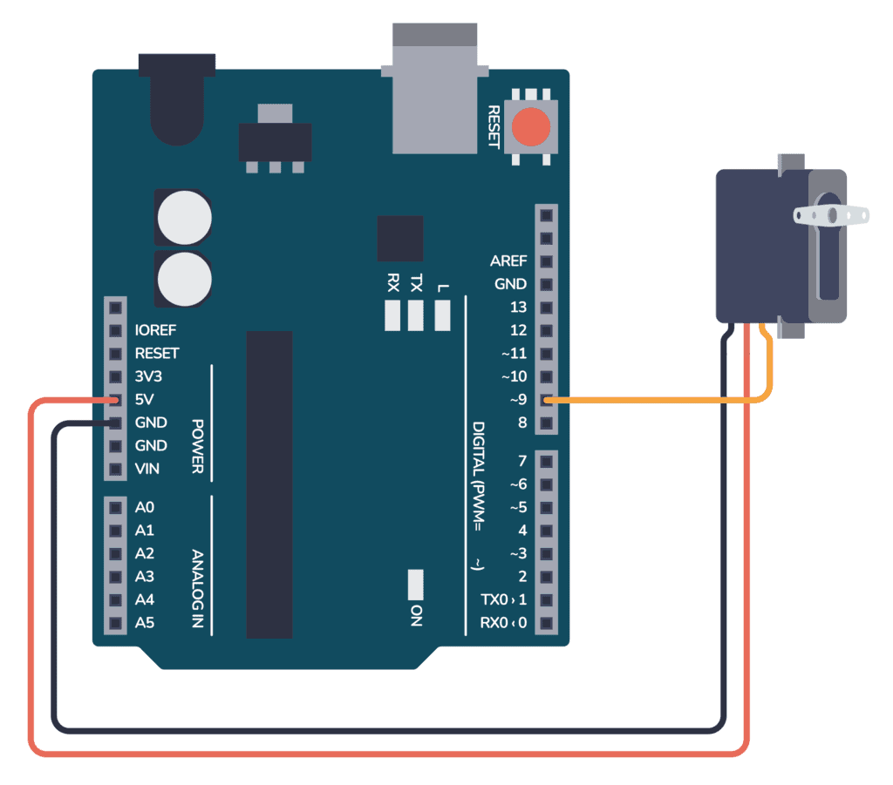

# Codici e Componenti

---

## Risorse

- [Download IDE Arduino](https://www.arduino.cc/en/software)
- [Simulatore Circuiti Elettrici](https://www.falstad.com/circuit/)

## Funzioni Base

``` c
#include <Servo.h> // tutte le librerie aggiuntive vanno indicate a inizio codice con questa sintassi


int variabile;    // in questa parte posso inizializzare delle variabili, se necessarie

void setup() {
  variabile = 1  // in questa parte scrivo il codice che deve essere eseguito appena arduino viene avviato
}

void loop() {
                // in questa parte scrivo la maggior parte del codice, ovvero le istruzioni che vanno ripetute all'infinito
  delay(15);    // delay è una funzione molto comune e utile che mette in pausa il processo per x millisecondi, in questo caso 15
}
```
## Componenti

{ align=left} Schema collegamento cavi Servo-Motore
- Giallo/Arancione: Segnale
- Rosso: Vin
- Rosso Scuro/Nero: Vout/GND
