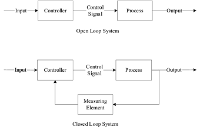

# Fondamenti di Automazione

---

## Il Feedback

{ align=left} Il Feedback introduce diverse opportunità, la possibilità di evitare errori e di poter sviluppare con modelli matematici più semplici processi che altrimenti risulterebbero molto più complesse (1)
{ .annotate}

1.  Seppur introducendo un fattore di imprecisione, non sempre trascurabile.

Un esempio molto semplice può essere fatto con il termostato. Quando viene impostata la temperatura desiderata, un sensore nella stanza controllerà se la temperatura è inferiore o superiore a quella richiesta. Se la temperatura è superiore allora non verrà azionato il sistema di riscaldamento, se la temperatura è inferiore invece allora è necessario accendere il riscaldamento, che verrà poi spento una volta che il sensore rivelerà il raggiungimento della temperatura desiderata. Un esempio di sistema di riscaldamento che non usa il feedback è il camino (1)
{ .annotate}

1.  Una bella differenza.

## Il Black-Boxing

Il concetto di Black-Boxing è più teorico che pratico, è un principio fondamentale che caratterizza l'epoca moderna di alta specializzazione e collaborazione di diverse figure professionali ad un unico progetto.

Non sempre è possibile avere una conoscenza completa di un fenomeno a cui si stà lavorando, è necessario spesso prendere il fenomeno complesso, "coprirlo" con una "scatola nera" ed avere ben chiaro semplicemente gli input che richiede, e gli output che consegna, e costruire il nostro lavoro su quella base.

Un esempio nella vita di tutti i giorni è il pc o lo smartphone, persino gli specialisti informatici non conoscono per interezza come funziona il sistema operativo o l'hardware con cui lavorano, questo però non gli impedisce di sapere quello che gli serve e niente più per fare il loro lavoro.