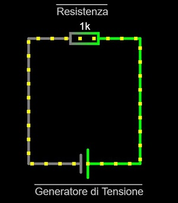
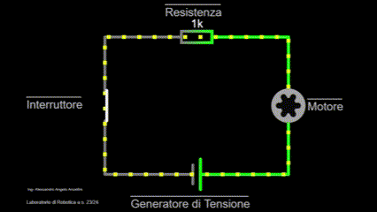

# Funzionamento di un Circuito Semplice

---

## Tensione, Resistenza e Corrente

Gli elementi fondamentali in gioco sono:

- La **Tensione**, tipicamente indicata come **V**, la cui unità di misura è il **Volt (V)**
- La **Resistenza**, tipicamente indicata come **R**, la cui unità di misura è l'**Ohm (Ω)**
- La **Corrente**, tipicamente indicata come **i**, la cui unità di misura è l'**Ampere (A)**

Tutto il meccanismo alla base dell'alimentazione elettrica e dell'"elettricità" in generale si basa sul principio di riuscire a far muovere gli elettroni (aventi una carica elettrica, e quindi "energia") lungo un cavo.

La **Tensione** è colei che spinge gli elettroni a muoversi e il componente fisico che si occupa di importare questa grandezza all'interno di un circuito è il **Generatore di Tensione**. Un esempio estremamente comune di generatore di tensione molto economico è la **Pila**.

La **Resistenza** è una caratteristica intrinseca di ogni cavo o componente, che al passaggio della corrente dissipa parte dell'energia in calore. Vengono utilizzati anche dei componenti con lo scopo preciso di Dissipare corrente, questi componenti vengono chiamati **Resistenze** (1)
{ .annotate}

1.  Ad esempio ci sono componenti come piccole luci led o piccoli motori che non tollerano una corrente superiore ad un certo valore, applicare una resistenza prima di questi componenti ne tutela il funzionamento.

La **Corrente** è colei che ultimamente alimenta i nostri dispositivi disposti lungo il circuito, anche perchè un circuito vuoto dove gli elettroni si muovono senza scopo non servirebbe a nulla.

---

## Circuito Chiuso e Circuito Aperto

{ align=left } Questo è un esempio di notazione grafica dei componenti in gioco. Come è possibile notare questo circuito è un cerchio chiuso, e il cavo che parte dal generatore di tensione da un lato, ritorna dall'altro lato.

Infatti i generatori di tensione hanno un comportamento simile a dei magneti, generano un flusso di elettroni verso un lato che deve riaffluire dall'altro lato. Anche perchè se provassimo ad immaginare un punto in cui il filo si interrompesse gli elettroni dove andrebbero? Uscirebbero dal cavo e andrebbero a spasso ad alimentare il mondo?

Possiamo quindi dire che la corrente circola in un circuito se e solo se il circuito è chiuso, nel momento in cui anche per un millisecondo il circuito si aprisse, gli elettroni si interromperebbero immediatamente e il generatore di tensione non svolgerebbe più il suo ruolo fino a quando il circuito non ritornerà ad essere chiuso.

{ align=right } Se vogliamo introdurre un componente che possa essere alimentato dal nostro circuito possiamo ad esempio inserire un semplice motore DC che inizierebbe ad entrare in funzione appena aggiunto al circuito, se volessimo spegnere il motore senza rimuoverlo ci basterebbe far smettere di passare gli elettroni lungo il circuito.

Come sappiamo gli elettroni smettono di passare in tutto il circuito nel momento preciso in cui lo stesso non è chiuso, quindi gli interruttori sono dei cavi "mobili" che aprono e chiudono il circuito a nostro piacimento.

